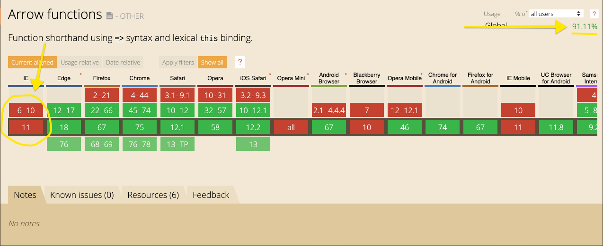

# Javascript Arrow Functions

Red Ventures Micro Workshop

- [Javascript Arrow Functions](#Javascript-Arrow-Functions)
  - [Safe Harbor](#Safe-Harbor)
  - [Life Without Arrow Functions](#Life-Without-Arrow-Functions)
  - [What is an Arrow Function](#What-is-an-Arrow-Function)
  - [Benifits of Arrow functions](#Benifits-of-Arrow-functions)
  - [When not to use arrow functions](#When-not-to-use-arrow-functions)
  - [Resources](#Resources)


## Safe Harbor

While arrow funcitons have major support in most modern browsers, some olders browser do not support the feature. Therefore it is up to you to make sure the browsers you support are addressed. You can consult [Can I use](https://caniuse.com/#feat=arrow-functions) for a full list of supported browsers for this feature.



## Life Without Arrow Functions

```js

// Function Decleration
foo(){
  alert("Hello, World")
}

foo()

// Function Expression
const bar = function(word) {
  alert(`Hello, ${word}`)
}

```

## What is an Arrow Function


> An **arrow function expression** is a syntactically compact alternative to a regular function expression, although without its own bindings to the `this`, `arguments`, `super`, or `new.target` keywords. Arrow function expressions are ill suited as methods, and they cannot be used as constructors.
>
> -- <cite>MDN</cite>

- **A arrow function is not just _syntactic sugar_ for js functions**
- Arrow function are always annoymous functions

## Benifits of Arrow functions


- concise syntax
- implicit returns
- no rebinding of `this`

## When not to use arrow functions


There are a few cases where you do not want to just use arrow functions without some significant rework.

- Click Handlers
- Object Methods

```js
const game = {
  score: 3,
  increase: function() {
    this.score++
  }
}


// don't do
const game = {
  score: 3,
  increase: () => this.score++
}

// Better refactor
const game = {
  score: 3,
  increase() {
    this.score++
  }
}
```

- When you need `arguments` keyword`

## Resources

- [Wes Bos - JavaScript Arrow Functions Introduction](https://wesbos.com/arrow-functions/)
- [Wes Bos - When Not to use an Arrow Function](https://wesbos.com/arrow-function-no-no/)
- [Fun Fun Function: Arrow Functions](https://www.youtube.com/watch?v=6sQDTgOqh-I)
- [MDN: Arrow Functions](https://developer.mozilla.org/en-US/docs/Web/JavaScript/Reference/Functions/Arrow_functions)
- [When (and why) you should use ES6 arrow functions — and when you shouldn’t](https://www.freecodecamp.org/news/when-and-why-you-should-use-es6-arrow-functions-and-when-you-shouldnt-3d851d7f0b26/)
- [Official Spec](https://www.ecma-international.org/ecma-262/6.0/#sec-arrow-function-definitions)

